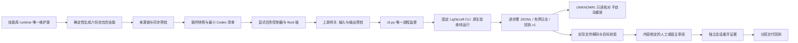
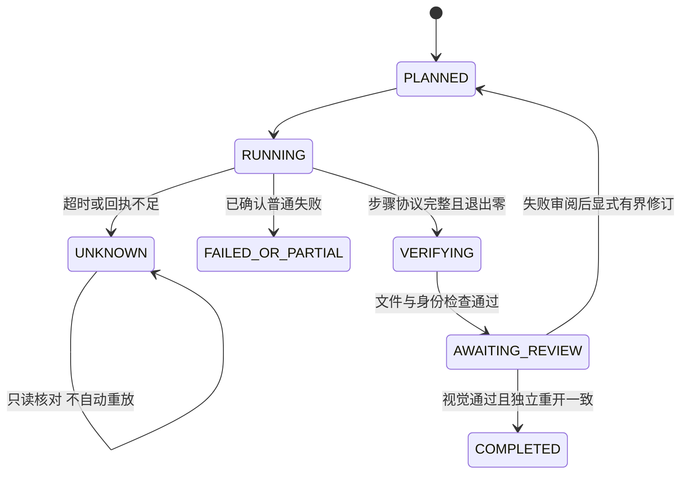

# Lightcraft 本地实现架构

技能库维护公共运行资源，生成六份可单独安装的技能；插件消费受摘要保护的候选快照，额外提供任务和审阅控制器。开发版本 0.1.0-dev.1 与固定原生 0.2.1 分别核验，未发布候选不伪造 tag/commit。

直接 argv 接口仍保留；完整逐步骤审计通过 domain/steps 计划入口。能力目录绑定二进制/版本/Headless 模式，离线目录不能授权执行。日志落盘与解析均有预算，超限保留未知和完整性事实；进程停止不证明所有后代终止。写入预检针对已知命令，不宣称通用沙箱或自动回滚。

文件可解码、格式/尺寸/位深/色彩符合、原片未变、独立重开和视觉判断分别记录；没有色彩证据时不宣称符合。任务与审阅 Schema 随插件分发，旧回执只读，修订次数不因重启重置。

详见 [实施证据与未完成门禁](verification/implementation-evidence.md)。当前未执行原生安装/照片验收、宿主加载、模型分派和独立视觉检查；Python 3.11/3.12/3.13 远端离线 CI 已通过，main 已推送，开发版发行仍为草稿。Connect/MCP、扩展照片能力、跨平台/ArtCraft/移动交付为独立 OPEN 变更，不由基础检查关闭。
