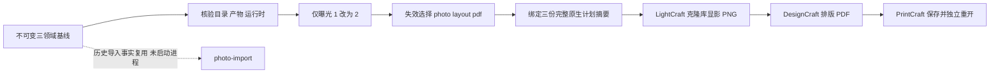

# 显式选择性原生重建增量证据

2026-10-08；对应 SEXT3-3/PEXT3-3 的选择性原生重建部分。手机/平板设备验收尚未完成，综合任务 1.3 保持 OPEN。

原生 CLI 均沿用 0.2.1 / macOS arm64，完整二进制/锁/资源身份在 native/native-exchange-report.json。验收驱动源码、原生监督器和网关的 SHA256 也绑定该报告。没有安装、升级或修改其他仓库，没有下载模型或使用用户素材。

实际仅执行 photo、layout、pdf 三个任务，与执行前的失效集合完全一致。photo-import 的旧请求和导入 ID 从已核验基线复用，当前根目录没有该任务的原生进程回执。版本/目录发现及 PDF 独立重开是另行记录的诊断调用，不计作任务节点。曝光 1→2 的选择计算在原有逻辑路径上进行；克隆目录的实际原生输出路径在执行前另由 rebuild-native-plans.json 完整绑定，逐阶段输入的具体新摘要在实际上游产物产生后通过公共协议前检绑定。

原图摘要不变；新显影 PNG、版面 PDF、交付 PDF 摘要均不同于基线。新 PDF 独立重开为一页 96×64pt；PNG 技术解码、库持久状态、DesignCraft 保存/导出及 PrintCraft 业务结果均核对通过。整个原基线目录（含原库、旧产物、回执）在执行前后逐文件 SHA256 相同。克隆库仍使用原基线的媒体绝对路径，该路径和摘要明确保留，并非声称已制作可移动设备包。

ArtCraft 实际 contracts.ts、TaskLedger planned 账本及 dependency_graph.ts 对新产物和请求复核通过，见 native/protocol-acceptance.json。该报告另外改变曝光以计算新的失效差分，但不执行第三次重建。插件当前 craft-inspect 的实际选择复核见 plugin-selection-inspection.json；该接口只计算，不授予执行或自动重放权限。

三项实际失败回归见 failure-regressions.json 与 failures/：无实际曝光变化在启动原生调用前拒绝；篡改基线原图在启动原生调用前拒绝；真实持有原库 catalog.lock 排他锁时，库克隆拒绝、锁 inode 保持不变，没有启动照片/版面/PDF/导入任务。库占用案例允许运行固定二进制版本/能力只读发现，不把它们冒充任务执行。三例均未自动重放。

native/ 归档保留历史绝对路径，不分发库与 SQLite 账本。当前归档文件再次经本地消费器及 ArtCraft 公共产物校验，见 archived-artifact-verification.json。基线完整报告和产物见上一轮 docs/verification/exchange-20261008/native/；原验收目录保留在工作区 evaluation-results 下。发行门禁仍有 host/visual/platform 缺口，当前验收不证明 ArtCraft WorkflowEngine/LocalRunner、宿主自动路由、通用 DAG 重建器或移动设备交付。

完整本地回归：Python 3.12 与 3.13 各 94 项通过。包结构、生成资源/受管来源快照一致性、OpenSpec strict 均通过；当前源码身份见 local-report.json。
