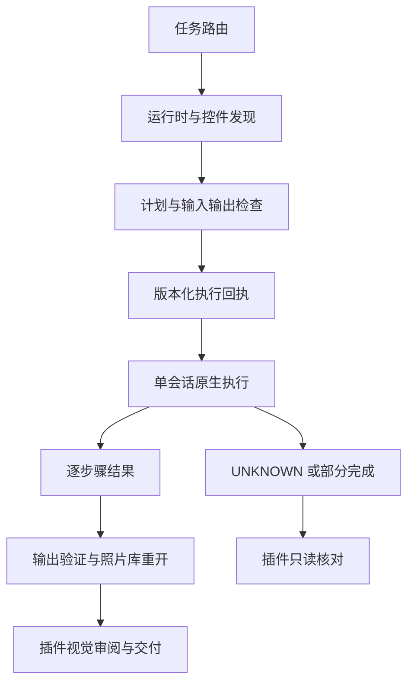

## Context

2026-10-08 分析基线：版本 0.1.0-dev.1，CLI 锁 0.2.1，Python 3.11+，仅 darwin-arm64；六项技能各自携带相同的 bootstrap/cli/commands/command_gateway/runtime.lock。19 项本地测试通过，但不运行原生程序。项目尚无 Git，不能虚构提交身份。参见 [proposal](proposal.md)。

已确认：cli.py 超时 600 秒后输出 unknown 并退出 1，网关 900 秒等待取得该退出码后写 FAILED_OR_PARTIAL；网关未解析逐步骤 JSON Lines；直接 CLI 不产生计划回执。当前纯文本参数不能当作 JSON Schema。

## Goals / Non-Goals

**Goals:** 明确六技能分工，统一可验证执行契约，支持完整照片流程；让插件只消费公共结果和能力。

**Non-Goals:** 本变更不更改原生 LightCraft、抄用 Dreamina 积分审批、不承诺本地 runId 提供 exactly-once、不初始化其他项目、不扩张平台声明；SAM、更多 RAW、Connect/MCP、跨平台和 ArtCraft 扩展按任务第 7 组单独治理。

## Decisions

### D1 技能路由与资源维护

`lightcraft-use` 负责意图路由、阶段交接和结果汇总；setup 负责诊断安装；cli 负责公共调用、发现和错误；library/develop/export 各自维护领域操作。保持六项上游技能，不按每个命令新建技能。支持隐式调用配置的宿主中，以 use 为默认路由；其他技能仍可被用户显式指定。

开发侧选定一个公共资源源目录及确定性生成入口，分发时复制完整运行资源到各技能。相对兄弟目录共享模块虽然省文件，但会破坏粒度安装，因此不采用。跨技能文档按名称及安装命令交接，技能内资料使用自身 references/examples。

每项领域技能按输入、前置、副作用、输出、恢复、验收编写，并提供成功、部分失败、恢复和越界拒绝示例。命令覆盖表记录负责技能、固定版本、模式、示例和测试；未验证条目明确标记，不用文档词频充当运行证明。

### D2 诊断与能力身份

提供纯检查模式（建议公开命令 `doctor --no-install`，实施时统一入口命名），不调用现有自动安装路径。在线执行继续复用已授权安装，不重复询问。发现报告绑定实际可执行文件 SHA-256、版本、模式、命令目录与 controls 摘要；离线目录不得授权执行。研究目录 HEAD 的能力不自动归属于 0.2.1 制品。

### D3 单一进程监督与版本化回执

先写嵌套超时红灯测试，再明确一个组件拥有原生进程生命周期；argv 透传与网关复用同一结果定义，不使用两层相互遮蔽的超时分类。记录 runId、schemaVersion、时间、原生身份、启动与结束事实、步骤结果、stdout/stderr 引用、输入/资源摘要。回执与日志对大输出采用有限内存、落盘流式处理及明确截断标记；不得因截断静默认定全步骤成功。

计划仍为 domain/steps，每步 command/params；LightCraft steps 转为 JSON Lines。校验命令/参数文本和会话前置的边界保持显式。缺失结果、重复结果或不完整 JSONL 返回协议未确认状态；进程零退出不越过产物审阅门禁。NotSaved 类原生结果单独保留，避免重复执行已在内存生效的修改。

输入分为需保持的原片与有意修改的照片库/工作副本；后者也记录身份及预期变化，不要求不可变。输出约束在执行前检查已知写入目标，执行后再核对，不宣称是通用文件系统沙箱。直接 CLI 为低层透传，文档必须说明不具备完整回执；交付流程默认走网关。

### D4 照片工作流与证据

library 返回照片 ID/路径映射和重复导入结果；develop 保存基线、修改范围、预览和调整后参数；export 在原生报告路径基础上独立读取文件，验证格式、尺寸、位深及色彩信息。先用合成 PNG/JPEG 验证，真实 RAW 按相机型号、变体和样本摘要分列。

### D5 跨项目所有权与依赖

| 所有者 | 权威内容 | 消费者 |
|---|---|---|
| 本变更 | 命令、控件、原生结果、执行回执、照片库重开与输出事实 | 插件任务编排、恢复和交付 |
| 插件配套变更 | 任务状态、候选/审阅关联、宿主配置、来源发行锁 | 宿主与发布流程 |

S-3.4 的回执接口冻结先于 P-2.1 适配；S-4.5 输出事实接口先于 P-3.2 审阅交换；实际发布需先完成 S-6.2 与插件发布门禁。跨仓引用是规格导航，安装后的技能不得依赖这些本地相对路径。

## Risks / Trade-offs

- 原生结果缺少结构化错误码 → 保留原始数据与未知分类，不只靠字符串猜测可重放。
- 杀死启动进程不证明所有子进程退出 → 记录可确认的终止范围，剩余状态 UNKNOWN，不释放恢复门禁。
- 校验与执行之间文件可能变化 → 执行前后核对、限制已知写入目标；不宣称完全消除 TOCTOU。
- 六份代码副本可能漂移 → 确定性生成与逐字节校验；保留安装自包含性。
- 配置有输出色彩标签不代表颜色正确 → 同时记录文件元数据、参考图和真实视觉结论。

## Migration Plan

先落地回归与新回执读取器，再修改生产者，最后同步插件。无版本旧回执保持原文件，只读展示并要求核对，不默认为新状态。新字段与状态变更通过 schemaVersion 协商；调用计划与直接透传保持兼容。回退保留新旧记录及照片库，不通过删除状态或降级解释器绕过未知结果。原生版本升级属于独立验收，不在本轮静默修改锁。
